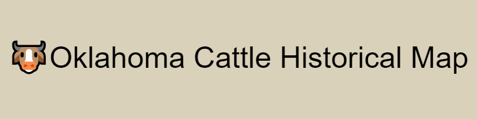
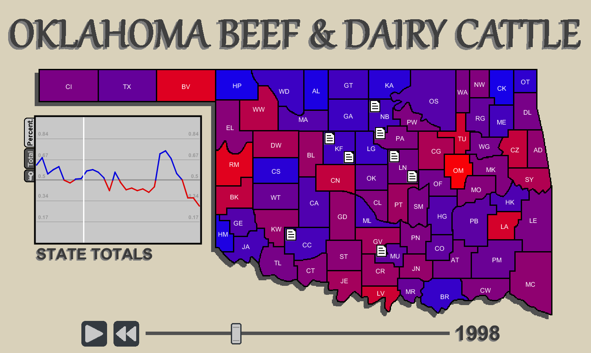

# Description
This project is an interactive map of historical cattle statistics in Oklahoma. It was designed as a final project for the Honors Course: Mapping Oklahoma. The objective was to create a map in any medium depicting some aspect of Oklahoma. This interactive map charts the change in the demographics of cattle farms in Oklahoma from 1990 to 2019. Farms have progressively switched from dairy to beef cattle, and the aim of this project was to illustrate that transformation over the years.

# <ins>Features</ins>
* Each county is colored in a linear gradient from blue (dairy) to red (beef). The brightest blue is the year with the most dairy cattle. The brightest red is the year with the most beef cattle.
* The key on the left shows the graph of the state cattle totals, both the total values the normalized percentage used for coloring.
* Individual counties can be selected to show the data graphs for that specific county
* The bottom playback bar can play in both directions, and the cursor can be dragged to position using the mouse.
* The document icons on the map represent anecdotes about cattle farming in Oklahoma. Clicking on the doc brings up quotes from the farmers in the key window. 
* Clicking on the source link at the bottom of the anecdote window links to the source web article

# Snapshot


# Build Instructions
This project was created in the Processing IDE https://processing.org/download <br>
1. Open  ```oklahoma_cattle_map.pde``` in Processing IDE.
2. Run the project.

# Run Instructions
The program can be run in a Windows environment by running ```OK_Cattle_Map.exe``` from the ```oklahoma_cattle_map``` directory.

# Possible Improvements
* General Optimization: This project was written quickly with few refactoring efforts and could benefit from some code-rework.

# Known Bugs
* There are no bugs currently being tracked

# Contributions & Licensing
This project is closed to development, however feel free to fork and use any part of the codebase.

# Acknowledgements
All data sourced from https://www.usda.gov/content/usda-open-data-catalog<br>
All stories sourced from https://dc.library.okstate.edu/digital/collection/Farm